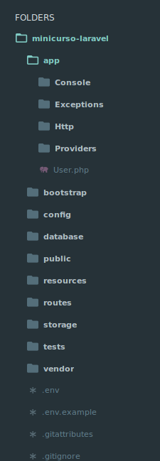

#HSLIDE 
## Laravel
##### Desenvolvimento rápido e simples

#HSLIDE
## Quem sou eu

- Programador web desde os 16 anos
- Formado em Sistema de Informação pelo IFPR
- Atualmente trabalhando na FluxoTI
- Vi códigos tão horríveis que assustariam qualquer um de vocês

#HSLIDE
## O que é o PHP?

- PHP é um acrônimo recursivo para PHP: Hypertext Prepocessor
- Linguagem server-side para desenvolvimento web
- Começou a ser desenvolvido em 1995 por Rasmus Lerdorf
- Atualmente a última versão lançada é a 7.0.11

#HSLIDE
## O que é um Framework?
Framework é um “esqueleto”, um modelo que nos propicia o essencial para desenvolver alguma coisa.

#HSLIDE
## DRY
##### Don't Repeat Yourself

#HSLIDE
## A maior parte das aplicações web precisa de:

- Login de usuários.
- CRUD’s
- Integrações com redes sociais.
- Operações de banco de dados.
- Envio de e-mails.
- Notificações para os usuários.
- etc

#HSLIDE
## Por que então precisamos reescrever essas funcionalidades a cada novo projeto?

#HSLIDE
## Composer
- Gerenciador de dependências para aplicações PHP.
- Não precisamos ter nossas dependências juntas com o projeto, podemos instalar utilizando o composer.
- Qualquer pessoa pode escrever uma biblioteca para PHP e publicá-la para que todos possam utilizá-la.

#VSLIDE?image=https://raw.githubusercontent.com/lukzgois/minicurso-utfpr/slides/_slides/images/packagist.png

#HSLIDE
## O que é o Laravel?
- O Laravel é um framework em PHP baseado no conceito de RAD (Rapid Application Development).
- Desenvolvido por Taylor Otwell.
- Possui código aberto e uma comunidade ativa.
- Utiliza o composer, fornecendo todo o poder das demais bibliotecas escritas para PHP.

#VSLIDE


#HSLIDE
## Por que eu escolhi o Laravel?
- Facilidade para aprender
- É divertido!
- Preocupação com a rapidez do desenvolvimento
- Uma das melhores comunidades que já participei
- Constante evolução

#HSLIDE
## Ecossistema do Laravel
- Lumen (lumen.laravel.com): microframework "irmão" do Laravel
- Forge (foge.laravel.com): provisionamento de servidores
- Envoyer (envoyer.io): zero downtime deploys
- Spark (spark.laravel.com): construa rapidamente aplicações SAAS

#VSLIDE?image=_slides/images/lumen.png

#VSLIDE?image=_slides/images/forge.png

#VSLIDE?image=_slides/images/envoyer.png

#VSLIDE?image=_slides/images/spark.png

#HSLIDE
## Criando a aplicação
```sh
laravel new minicurso-laravel
cd minicurso-laravel
php artisan serve
```

#VSLIDE?image=_slides/images/first-app.png

#HSLIDE
## Estrutura de Pastas


#HSLIDE
## Ponto de entrada: as rotas
- As rotas são o ponto de entrada para uma aplicação Laravel.
- Através das rotas direcionamos as requisições dos nossos usuários para os controladores corretos.
- Podemos utilizar closures do PHP no arquivo de rotas **PARA FINS DE TESTES**, pois esta não é uma boa prática.

#VSLIDE?image=_slides/images/routes.png

#HSLIDE
## Controlando a aplicação: controllers
- Controllers são responsáveis por “controlar” (ahãã!) a nossa aplicação.
- Eles recebem a requisição e a direcionam para o local correto.
- É uma boa prática manter o controller com pouco código, deixando-o mais limpo.

#VSLIDE
```sh
php artisan make:controller TesteController
```

#HSLIDE
## Dando vida a aplicação: views
##### Views contém a apresentação da nossa aplicação para o usuário (HTML, CSS, Javascript, etc).

#HSLIDE
## Indo ao banco: migrations
##### Houve uma triste época onde eu guardava as migrations como arquivos .sql em uma pasta do projeto. Felizmente essa época ficou no passado.

- Migrations servem para que possamos ter um controle das alterações no banco de dados.
- Com as migrations podemos “versionar” o estado do nosso banco de dados.
- São uma maneira prática de compartilhar entre a equipe o banco de dados.
- Facilitam também o deploy da aplicação, auxiliando na automatização deste processo.

#VSLIDE
```sh
php artisan make:migration create_posts_table --create=posts
```
*É uma boa prática sempre manter os nomes das tabelas no plural.*

#VSLIDE
Executando as migrações
```sh
php artisan migrate
```

Voltando as migrações
```sh
php artisan migrate:rollback
```

#HSLIDE
## Semeando a aplicação: seeds
- Seeds são uma maneira de popularmos nosso banco de dados com informações.
- Podemos utilizar informações falsas para nos auxiliar no processo de desenvolvimento.
- Temos a ajuda da biblioteca “Faker” para a criação de informações de exemplo.

#VSLIDE
Criando o seeder
```sh
php artisan make:seeder UserSeeder
```

Executando o seeder
```sh
php artisan db:seed
php artisan migrate --seed
php artisan migrate:refresh --seed
```

#HSLIDE
## A ponte para o banco: eloquent
- Eloquent é o ORM do Laravel.
- É uma abstração do banco de dados, serve como uma camada intermediária pra que não tenhamos que escrever queries diretamente.
- Facilita a manipulação dos dados e também caso seja necessário mudarmos o banco de dados utilizado.

#VSLIDE
```php
User::all();
User::first();
User::where('name', 'Lucas')->get();
```

#HSLIDE
## Como me aprofundar no laravel?
- Documentação: [http://laravel.com/docs/5.1](http://laravel.com/docs/5.1)
- Documentação em Português: [http://laravel-docs.artesaos.org/docs/5.1](http://laravel-docs.artesaos.org/docs/5.1)
- Slack do Laravel-Br: [http://slack.laravel.com.br/](http://slack.laravel.com.br/)
- Laravel News: [https://laravel-news.com/](https://laravel-news.com/)
- Laracasts: [http://laracasts.com/](http://laracasts.com/)

#HSLIDE
## Github
#### https://github.com/lukzgois/minicurso-utfpr

#HSLIDE
## Contato
#### Lucas Padilha Gois
- E-mail: lucaspgois@gmail.com
- Twitter: @lukz_
- Slack do Laravel-BR: @lukz

